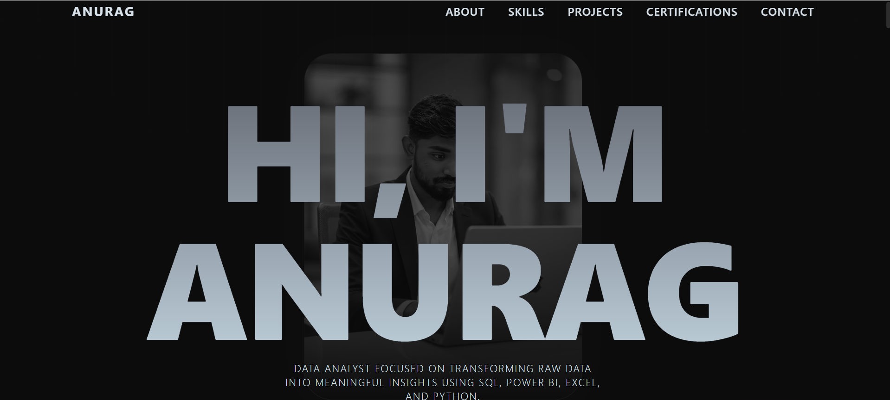

# 📊 Data Analyst Portfolio — Anurag Kushwaha

A modern, interactive, and responsive Data Analyst portfolio showcasing my practical projects in **SQL, Power BI, Microsoft Excel, and Python**.

The portfolio highlights my approach to data cleaning, exploratory data analysis, dashboard development, data visualization, and transforming raw data into meaningful business insights.

## 🌐 Live Portfolio

🔗 **View Live Portfolio:**  
https://anuragkush007.github.io/Data-Analyst-Portfolio/

## 🖥️ Portfolio Preview



## 👨‍💻 About Me

I am an aspiring Data Analyst with hands-on experience working with SQL, Power BI, Microsoft Excel, and Python.

My projects focus on analyzing real-world datasets, cleaning and transforming data, identifying trends and patterns, building interactive dashboards, and presenting insights in a clear and meaningful way.

This portfolio brings together my key Data Analytics projects, technical skills, professional certifications, education, and contact information in one place.

## 🚀 Featured Projects

### 🚕 SQL Cab Booking System

A SQL-based database project focused on designing and analyzing a cab booking system.

The project demonstrates practical SQL skills including database querying, joins, aggregations, subqueries, and analytical techniques for extracting meaningful information from structured booking data.

**Tools & Technologies:** SQL, MySQL, Database Analysis

🔗 Repository:  
https://github.com/AnuragKush007/Project-SQL_Cab_Booking_System

---

### 📈 D-Mart Sales Analysis — Power BI

An interactive Power BI project focused on analyzing sales performance and presenting key business metrics through an intuitive dashboard.

The project demonstrates data transformation, data modeling, KPI analysis, trend identification, and interactive business intelligence reporting.

**Tools & Technologies:** Power BI, Power Query, Data Visualization, Business Intelligence

🔗 Repository:  
https://github.com/AnuragKush007/Project-POWERBI_D-mart_Sales_Analysis

---

### ☕ Coffee Shop Revenue & Performance Analysis — Excel

An Excel-based business analysis project focused on transaction-level coffee shop sales data.

The analysis explores revenue trends, store performance, product category contribution, weekday performance, time-period sales patterns, and hourly transaction activity through an interactive dashboard.

**Tools & Technologies:** Microsoft Excel, PivotTables, PivotCharts, Data Analysis, Dashboard Development

🔗 Repository:  
https://github.com/AnuragKush007/Project-EXCEL_Coffee_Shop_Revenue_Performance_Analysis

---

### 🚗 Automobile Data Analysis — Python

An exploratory data analysis project focused on cleaning, analyzing, and visualizing automobile data using Python.

The project demonstrates practical data preprocessing, exploratory data analysis, statistical exploration, and data visualization techniques to identify patterns and relationships within the dataset.

**Tools & Technologies:** Python, Pandas, NumPy, Matplotlib, Exploratory Data Analysis

🔗 Repository:  
https://github.com/AnuragKush007/Project-PYTHON_Automobile_Data_Analysis

## 🛠️ Data Analytics Skills

| Category | Skills & Tools |
|---|---|
| Data Analysis | Data Cleaning, Exploratory Data Analysis, Trend Analysis, KPI Analysis |
| SQL & Databases | SQL, MySQL, Joins, Aggregations, Subqueries |
| Business Intelligence | Power BI, Power Query, Dashboard Development, Data Visualization |
| Microsoft Excel | PivotTables, PivotCharts, Lookup Functions, Data Cleaning, Dashboarding |
| Python | Python, Pandas, NumPy, Matplotlib |
| Visualization | Interactive Dashboards, Charts, KPI Reporting, Business Insights |

## 🎓 Professional Certifications

My professional certifications and learning credentials are available in the following repository:

🔗 **Professional Certifications:**  
https://github.com/AnuragKush007/Professional-Certifications

## ✨ Portfolio Features

- Modern and responsive user interface
- Data Analyst-focused professional branding
- Interactive project showcase
- Scroll-based animations and transitions
- Dedicated Data Analytics skills section
- Four featured analytics projects
- Professional certifications showcase
- Resume-based professional information
- Responsive design for mobile, tablet, laptop, and desktop
- Direct links to GitHub projects and professional profiles

## 💻 Portfolio Technology Stack

The portfolio website is built using:

- React
- TypeScript
- Tailwind CSS
- Framer Motion
- Lucide React
- Vite

These technologies are used to build the portfolio website, while the professional focus of the portfolio is **Data Analytics**.

## 📁 Project Structure

```text
Data-Analyst-Portfolio/
├── public/
│   └── images/
├── src/
│   ├── assets/
│   ├── components/
│   ├── App.tsx
│   └── main.tsx
├── .github/
│   └── workflows/
├── index.html
├── package.json
├── tailwind.config.js
├── tsconfig.json
└── vite.config.ts

🤝 Connect With Me
Portfolio: https:/anuragkush007.github.io/Data-Analyst-Portfolio/
GitHub: https://github.com/AnuragKush007
LinkedIn: https://www.linkedin.com/in/anurag-kushwaha-analytics/

⭐ If you find my projects useful, feel free to explore the repositories and connect with me for Data Analyst opportunities and professional collaboration.